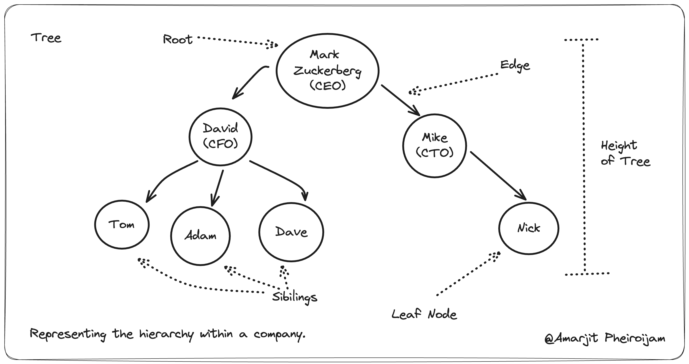

# Data Structure

Welcome to the Data Structures Made Simple course! This repository is dedicated to making data structures as simple as possible. Through clear explanations, practical examples, and hands-on exercises, you'll quickly grasp the essentials and be ready to apply them in real-world scenarios.

Happy learning, and let's dive in!

# Table of contents

- **Getting Started**
  - Introduction
  - What is data structure?
  - Real-world examples for data structures

# Introduction
Welcome to the data structure made simple course by Amarjit Pheiroijam, where learning is as exciting as a Netflix blockbuster! Grab your chai, settle in, and get ready for an adventure that’s more fun than a cricket match between India and Pakistan.

Think of me as your friendly guide through this course—no boring lectures here, just interesting topics and amazing diagrams that won’t make you fall asleep.

So, sit back, relax, and make this journey enjoyable. Together, we’ll laugh, learn, and maybe even surprise our friends with how much fun education can be. Welcome aboard, and let’s get started!
 
# What is data structure?
A data structure is a special way of organizing and storing information on a computer so it can be used effectively.

Think of it like a smart way to arrange tools in a toolbox, so you can find and use them quickly and easily. Different data structures help with different tasks, like making lists, managing orders, or connecting related items. Here is an example

- Manage: Just as you manage tools in different sections of a toolbox, in a computer, you manage data using data structures such as arrays, lists, and dictionaries. Each data structure is designed to organize and manage data efficiently for specific tasks.

- Organize: Similar to organizing tools by type in a toolbox, in programming, data structures organize data elements logically. For example, arrays arrange data in a linear format, while trees organize data hierarchically, making it easier to access and manipulate.

- Store: Storing tools efficiently in a toolbox minimizes clutter and maximizes space. Likewise, data structures in programming store data in a way that optimizes memory usage and retrieval speed, ensuring efficient use of computational resources.

- Use Efficiently: With tools organized and accessible in a toolbox, you can work efficiently. In computer science, data structures ensure that operations such as searching, inserting, and deleting data are performed quickly and effectively, supporting efficient algorithmic performance.

In essence, just as a well-organized toolbox enhances productivity in handling physical tools, efficient data structures in computer science enhance software performance and usability by organizing, managing, storing, and using data effectively.

#### Definition
A data structure is a specialized format for organizing, managing, and storing data in a computer so that it can be accessed and modified efficiently. It defines the relationship between data, the operations that can be performed on the data, and the constraints on the data. 

Common data structures include arrays, linked lists, stacks, queues, trees, graphs, and hash tables, each suited to different kinds of applications and tasks.

# Real-world examples for data structures

### 1. Array
A collection of items stored at contiguous memory locations. All items are of the same type and can be accessed using an index.

Application: Storing a list of temperatures recorded every hour in a day.

Real-World Example: A temperature sensor array in a weather monitoring system records the temperature at hourly intervals. 

The array could look like this: [90,92,94,96,98,99,102,106,109, ...]

### 2. Linked List
A sequence of elements where each element points to the next. It allows for efficient insertion and deletion.

Application: Music playlist in a media player.

Real-World Example: Each song points to the next song in the playlist. A linked list allows easy insertion and deletion of songs. 

The playlist could look like:
Song1 -> Song2 -> Song3 -> Song4

### 3. Stack
A collection that follows the Last In First Out (LIFO) principle. Elements can only be added or removed from the top.

Application: Undo functionality in text editors.

Real-World Example: Each action (like typing or deleting text) is pushed onto the stack. To undo an action, the editor pops the last action off the stack and reverts it.

### 4. Queue
A collection that follows the First In First Out (FIFO) principle. Elements are added at the back and removed from the front.

Application: Print job management in printers.

Real-World Example: Print jobs are added to the printer queue in the order they are received. The printer processes the jobs in a first-come, first-served manner.

### 5. Hash Table (Hash Map)
A data structure that maps keys to values for efficient lookup. It uses a hash function to compute an index into an array of buckets or slots.
 
Application: Organizing files into directories (folders).

Real-World Example: Consider a file system where directories (folders) act as keys in a hash map, and files are stored within these directories.

### 6. Tree
A hierarchical structure with a root value and subtrees of children, represented as a set of linked nodes.

Application: Representing the hierarchy within a company.

Real-World Example: An organizational chart representing the hierarchy within a company. This structure can be represented as a tree, with the root as CEO at the top postion.

### 7. Graph
A collection of nodes (vertices) and edges connecting some or all pairs of nodes. Can be directed or undirected.

Application: Representing maps for navigation (e.g., Google Maps).

Real-World Example: Google Maps uses a graph where intersections are nodes and roads are edges. The graph helps in finding the shortest path, calculating distances, and providing navigation directions. 

